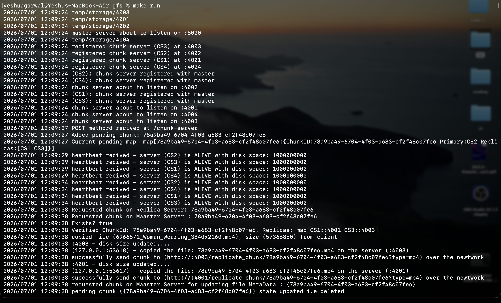
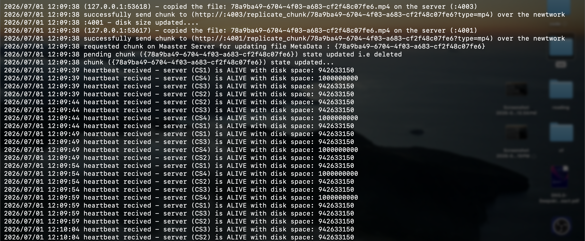

## Progress Update

1) Master Server running at PORT:800
2) Chunk Serve running at PORT: 4001,4002,4003,4004
3) Chunk Server are registered with Master Server before running
4) Heartbeats not recived so declared unactive and removed from heartbeat map
5) Done background Heartbeats at every 5 second 
6) Route GET /chunk-server working i.e. reteriving chunk_id & chunk_servers
7) Upload implement to the chunk servers along with replication and disk space deduction 
8) Implemented gfs client i.e. repo: https://github.com/yeshu2004/go-gfs-client

## To Implement 

1) Chunk id = logical timestamp when created
2) Master writes an entry to WAL file/ Log file i.e. filename & fileToChunk mapping like Allocate 
923847 Chunk for /logs/filename.txt
3) Retry logic and error handling has to be implmented for smooth file upload.
4) Check sum verification.  

## Issues 

1) by trying to upload a file of 2.5GB, currently with the master configuration, mater allows the file to start uploading to our chunk server but soon one server is not left with space, giving a error "not enough servers with space, as replication factor: Elibigle Server (1) - Replcation Factor (3)"
2) For now a single file name creates a lot of chunks i.e chunk_id based on the total number of chunks, but we dont have any mapping of these to retrive all chunks and store its file meta-data 

## Images

